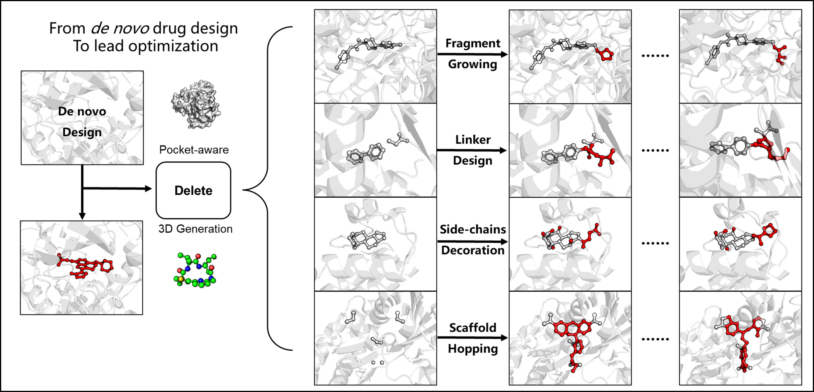

# :ghost:Delete: Deep Lead Optimization Enveloped in Protein Pockets through Deleting Strategy combined with a structure-aware network 
——When you face some problems in drug discovery, just delete! 

<div align=center>

</div>

## Environment

### First Approach

Install via conda .yml file (cuda 11.3)

```
conda install mamba
mamba env create -f delete_environment.yml -n delete
conda activate delete
```

Of note, the mamba could be replaced by conda.

### Second Approach 

We also offer a Conda package for easy installation, which is available for download from [Zenodo](https://doi.org/10.5281/zenodo.7758282). After downloading, simply unzip the package in your conda environments directory. In my case, the directory is located at `~/.conda/envs`. We extend our sincere gratitude to the team at Zenodo, who provide a valuable free platform for storing large files for scholarly purposes.

```shell
mkdir ~/.conda/envs/surfgen
tar -xzvf delete.tar.gz -C ~/.conda/envs/delete
conda activate delete
```

Please remember to replace "my case" with your actual username or replace it depending on your requirements.

## Data

